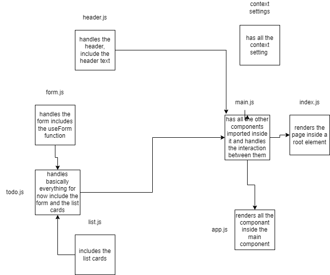

# Todo App

Todo App is a web application the enables the user to create a todo list and assign it to someone.

- The base of todo app.

  - a user can add a new task
  - a user can assign that task to name
  - a user can sort the task by name or by completetion
  - a user can delete the task
  - a user is can display only the incompleted tasks

- Added local storage

  - a user can now save his current settings to use later on
  - a user save his to do list, and it will render even after refresh 

## UML

;